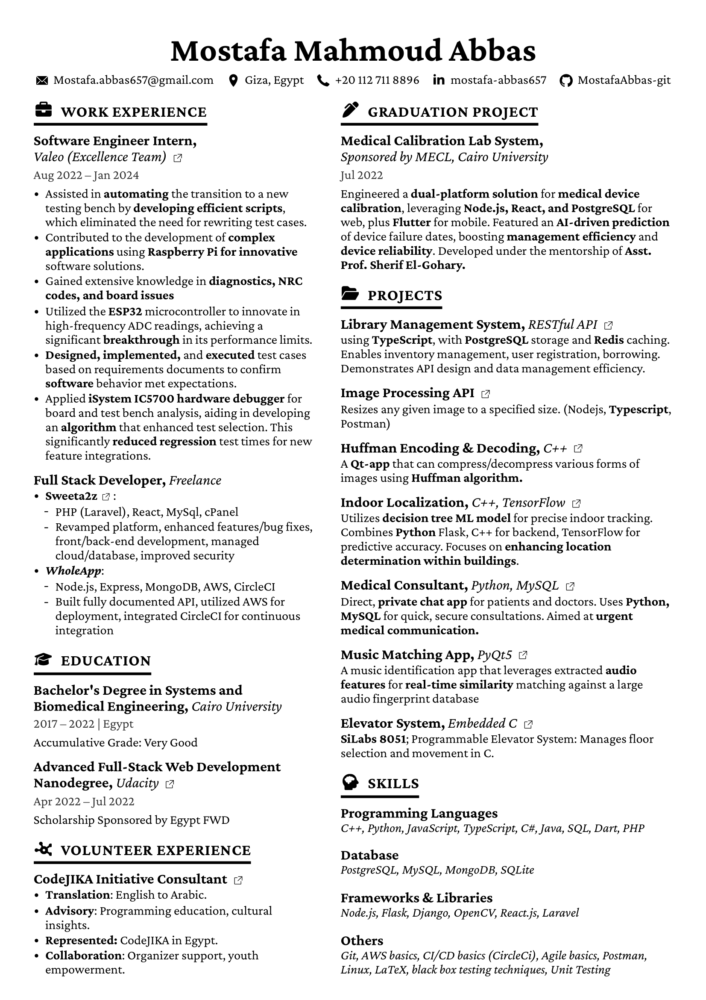

# Mostafa Mahmoud Abbas

Systems and Biomedical Engineering Fresh Graduate from Cairo University. Interested in BackEnd Web Development.

## 📝 Resume

---

## Languages

<code></code>
<code></code>
<code></code>
<code></code>
<code></code>

## Web & Mobile App Technologies

<code></code>
<code></code>
<code></code>
<code></code>
<code></code>
<code></code>

## Database

<code></code>
<code></code>
<code></code>
<code></code>

## MISC

<code></code>
<code></code>
<code></code>
<code></code>
<code></code>
